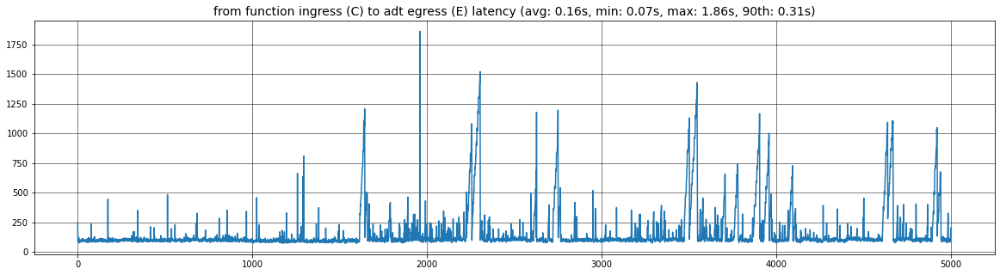
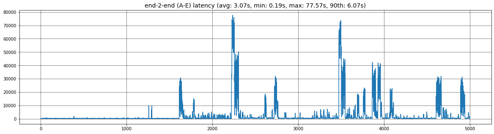

# Overview
Some notes and tools to measure the latency of events flowing along a sample Azure Digital Twin pipeline:

### The results

(with a simulated source sending 5K messages with a rate = 1 msg/s)

The latency from the Azure Function entry-point (C) to EH ingress (E):
* p90 = 0.31 s
* max = 1.86 s

The end-to-end latency (A-to-E):
* p90 = 6.07 s
* max = 77.57 s

The latter suggests that most of the end-2-end latency is spent waiting for the azure function to be triggered.
Maybe that's related to the Azure Function hosting plan, which is [consumption plan](https://docs.microsoft.com/en-us/azure/azure-functions/consumption-plan) (Y1).

TO DO: try with a [premium plan](https://docs.microsoft.com/en-us/azure/azure-functions/functions-premium-plan).

> NOTE: 'p90' is the 90th percentile

### The Tools
* a [console app](./ehConsumer/Program.cs) consuming the events from the EH and logging stats to a file
* a [jupyter](./jupyter/plot.ipynb) notebook to analyze the logs and plot the charts

# Steps to reproduce
* [deploy the solution](./deploy.md)
* [perform the test](./test.md)
* plot the charts with the [jupyter](./jupyter/plot.ipynb) notebook

