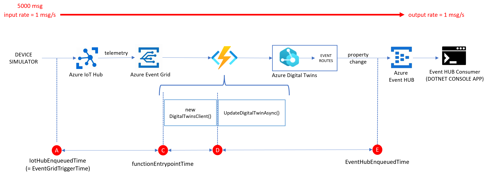

# Overview
Some notes and tools to measure the latency of events flowing along a sample Azure Digital Twins pipeline:

**DISCLAIMER:** *the performance figures shared in this article may be inaccurate and not applicable to your case. Do your own tests and assessment, using the methodology and tools described here if you will.*

### The results
The simulated source sends a total of 5K messages with a rate = 1 msg/s.

The events flow through the pipeline and hit the [ehConsumer](./ehConsumer/Program.cs) with the same rate (1 msg/s), but with some latency.  

The latency from the Azure Function entry-point (C) to EH ingress (E):
* p90 = 0.31 s
* max = 1.86 s

The end-to-end latency (A-to-E):
* p90 = 6.07 s
* max = 77.57 s

> NOTE: 'p90' is the 90th percentile

The latter suggests that most of the end-2-end latency is spent waiting for the azure function to be triggered. The Azure Function hosting plan is a [consumption plan](https://docs.microsoft.com/en-us/azure/azure-functions/consumption-plan) (Y1).

TO DO: try with a [premium plan](https://docs.microsoft.com/en-us/azure/azure-functions/functions-premium-plan). That should provide a significant performance boost.

### The Tools
* a [ehConsumer](./ehConsumer/Program.cs) console app to consume the events from the EH and logging stats to a file
* a [jupyter notebook](./jupyter/plot.ipynb) to analyze the logs and plot the charts

# Steps to reproduce
* [deploy the solution](./deploy.md)
* [perform the test](./test.md)
* plot the charts with the [jupyter notebook](./jupyter/plot.ipynb) 

